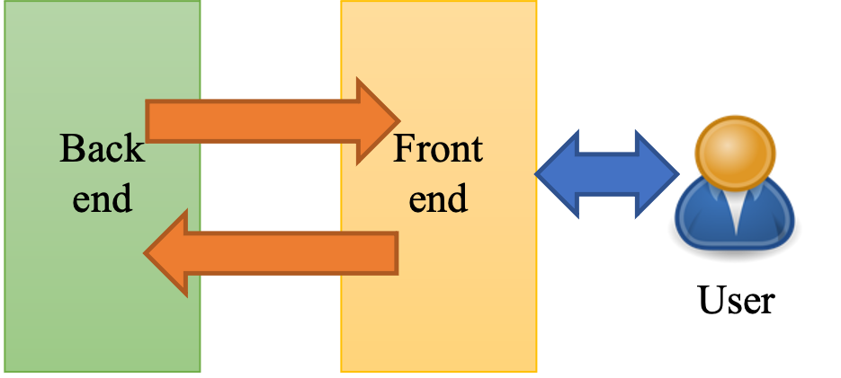
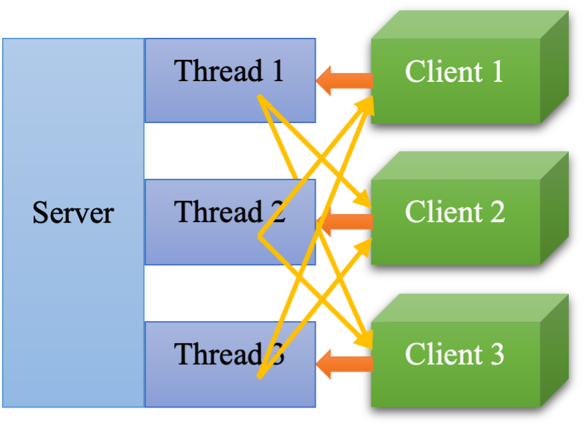
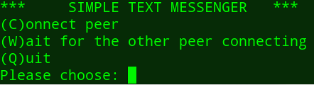
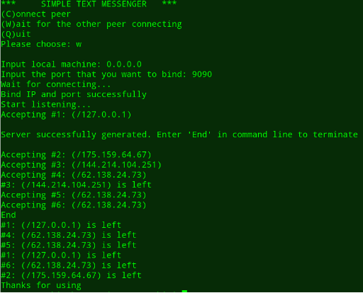
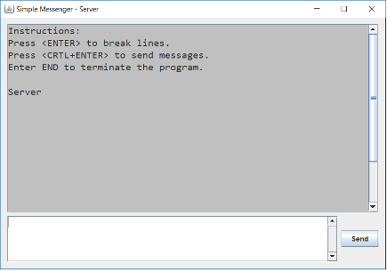

# CS3201 - Computer Network: Programming Assignment

## Design of the Software

### Message format

* Message from clients to server: Each message should be ended with the string “END”, followed by one or more line breaks, i.e., “\r\n”. The beginning of one message should not have any blank line.
* Message from server to clients: The first line of message should be “*address*:”, followed by one or more blank space, then followed by one line break. Each message should end with “END”, followed by one or more line breaks, i.e. “\r\n”.

### Modules of the Software

To make the development and testing easier, the software is divided into several parts shown in following figures:

## 

## Guide to Use the Program

### Start program

The execution start point is the `Main.main()` method. After starting this program, a promotion in command line will be shown as the following figure. User can type ‘c’ to connect to a server, type ‘w’ to act as a server, or type ‘q’ to quit the program.

### Server

At first, type “W” or “w” in the command line to choose the server. Next enter the IP address and port number you want to bind. Then a server-side chatting GUI will be created. The basic operation is same as client, but if you quit the GUI, all the clients will be forced to exit. At the end, you should type “END” in the command line to completely quit the program. When a client connects to the server or a client leaves a server, there will be a promotion printed in the command line. 

### Chat window

In the chat window, as displayed in previous figure, one can press `Ctrl+Enter` to send message.

## User Interface

### Components

The `UserInterface` class implements Window components defined in `java.swing` and `java.awt` packages, which contains two `JTextArea` objects implementing the output field and input field and one `JButton` object implementing the “Send” button. Layout and detailed structure design will be ignored in this report, but the general look of the interface is shown in following figure:

### Binding with Client

In the `.bindTo(chatBack)` method, the user interface will refer back end (i.e. saving that client in the instance field) to the client bond and define the further `.send()` method through the corresponding back end.

### Presenting Messages

Upon receiving messages sent by the server, the interface will call the `.pushToOutput()` method to append the receiving String message to the output field defined in the `JFrame`.

### Sending Messages

When the client presses `“CTRL+Enter”` or the Send button, the interface will read the input value in the input field defined in the `JFrame `with suitable input manipulation done. Then it will call the `.send()` method defined in back end to send out messages.

For more information, please see our [report](./project_report.pdf)
